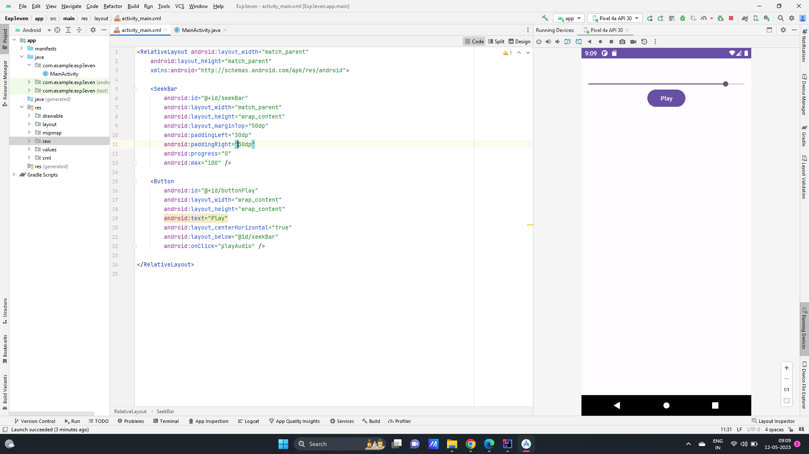
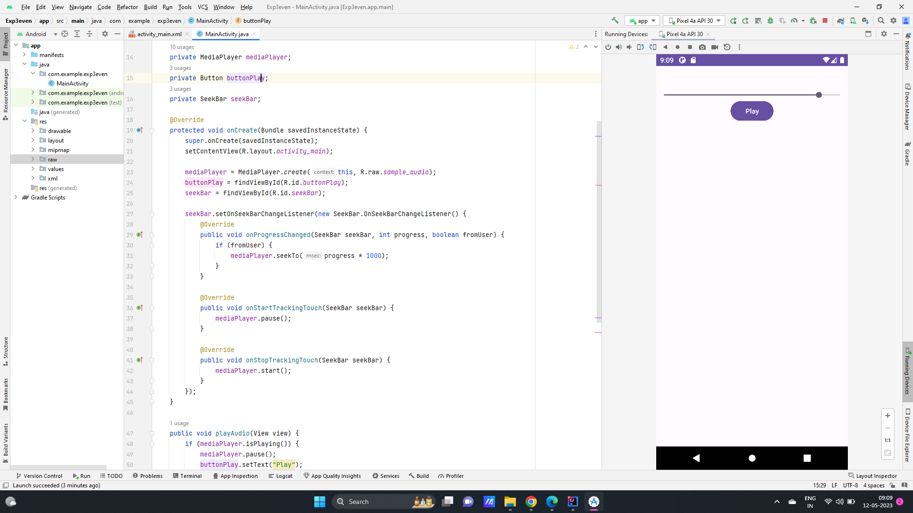

# Ex.No:3 Develop a simple application to play and control the audio file in android studio.


## AIM:

To develop a simple application, to play and control the audio file and to perfrom the start,pause and stop opeartion in Android Studio.

## EQUIPMENTS REQUIRED:

Android Studio(Min.required Artic Fox)

## ALGORITHM:

Step 1: Open Android Stdio and then click on File -> New -> New project.

Step 2: Then type the Application name as audiofile and click Next. 

Step 3: Then select the Minimum SDK as shown below and click Next.

Step 4: Then select the Empty Activity and click Next. Finally click Finish.

Step 5: Design layout in activity_main.xml and create start,pause and stop button.

Step 6: Display message give in MainActivity file.

Step 7: Save and run the application.

## PROGRAM:
```
/*
Program to play and control the audio file”.
Developed by:MANOJ CHOUDHARY V
Registeration Number :212221240025
*/
```
## MainActivity.java
```
package com.example.exp3even;

import android.media.MediaPlayer;
import android.os.Bundle;
import android.os.Handler;
import android.view.View;
import android.widget.Button;
import android.widget.SeekBar;

import androidx.appcompat.app.AppCompatActivity;

public class MainActivity extends AppCompatActivity {

    private MediaPlayer mediaPlayer;
    private Button buttonPlay;
    private SeekBar seekBar;

    @Override
    protected void onCreate(Bundle savedInstanceState) {
        super.onCreate(savedInstanceState);
        setContentView(R.layout.activity_main);

        mediaPlayer = MediaPlayer.create(this, R.raw.sample_audio);
        buttonPlay = findViewById(R.id.buttonPlay);
        seekBar = findViewById(R.id.seekBar);

        seekBar.setOnSeekBarChangeListener(new SeekBar.OnSeekBarChangeListener() {
            @Override
            public void onProgressChanged(SeekBar seekBar, int progress, boolean fromUser) {
                if (fromUser) {
                    mediaPlayer.seekTo(progress * 1000);
                }
            }

            @Override
            public void onStartTrackingTouch(SeekBar seekBar) {
                mediaPlayer.pause();
            }

            @Override
            public void onStopTrackingTouch(SeekBar seekBar) {
                mediaPlayer.start();
            }
        });
    }

    public void playAudio(View view) {
        if (mediaPlayer.isPlaying()) {
            mediaPlayer.pause();
            buttonPlay.setText("Play");
        } else {
            mediaPlayer.start();
            buttonPlay.setText("Pause");
        }

        final Handler handler = new Handler();
        handler.postDelayed(new Runnable() {
            @Override
            public void run() {
                if (mediaPlayer.isPlaying()) {
                    int currentPosition = mediaPlayer.getCurrentPosition() / 1000;
                    seekBar.setProgress(currentPosition);
                }
                handler.postDelayed(this, 1000);
            }
        }, 1000);
    }

    @Override
    protected void onDestroy() {
        super.onDestroy();
        mediaPlayer.release();
    }
}

```
## activity_mainn.xml
```
<RelativeLayout android:layout_width="match_parent"
    android:layout_height="match_parent"
    xmlns:android="http://schemas.android.com/apk/res/android">

    <SeekBar
        android:id="@+id/seekBar"
        android:layout_width="match_parent"
        android:layout_height="wrap_content"
        android:layout_marginTop="50dp"
        android:paddingLeft="30dp"
        android:paddingRight="30dp"
        android:progress="0"
        android:max="100" />

    <Button
        android:id="@+id/buttonPlay"
        android:layout_width="wrap_content"
        android:layout_height="wrap_content"
        android:text="Play"
        android:layout_centerHorizontal="true"
        android:layout_below="@id/seekBar"
        android:onClick="playAudio" />

</RelativeLayout>
```

## OUTPUT


   


## RESULT
   Thus a simple application, to play and control the audio file and to perfrom the start,pause and stop opeartion in Android Studio is developed and executed successfully.
